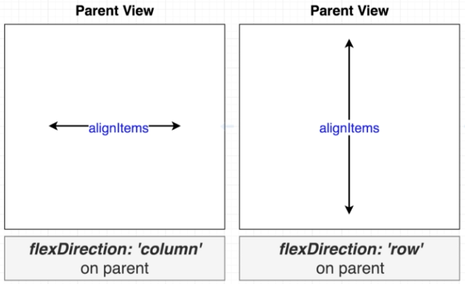

# JSX rules
1. Different JSX elements can be combined.
```jsx
const ComponentsScreen = () => {
    return (
        <View>
            <Text style={styles.textStyle}>This is the components screen</Text>
            <Text>This is body</Text>
        </View>
    );
}
```
2. **props(properties)**: JSX elements can be modified using props. ```style``` is a prop used above.
3. We can refer to Javascript variables inside JSX blocks using curly braces.
```jsx
const greeting = "hi there";
return (
    <View>
        <Text style={styles.textStyle}>This is the components screen</Text>
        <Text>{ greeting }</Text>
    </View>
);
```
4. We can assign JSX elements to a variable, and use this variable in a JSX block.
```jsx
const message = <Text>Welcome to react native!</Text>;
return (
    <View>
        <Text style={styles.textStyle}>This is the components screen</Text>
        {message}
    </View>
);
```

# React Native basics
## FlatList
- Displays scrollable list.
- Needs 2 basic props, ```data``` and ```renderItem```.

    ```jsx
    const friends = [
        { name: 'Friend #1', age: 11 },
        { name: 'Friend #2', age: 12 },
        { name: 'Friend #3', age: 13 },
        { name: 'Friend #4', age: 14 },
        { name: 'Friend #5', age: 15 },
        { name: 'Friend #6', age: 16 },
        { name: 'Friend #7', age: 17 },
    ];
    return (
    <FlatList
        data={friends}
        keyExtractor={friend => friend.name}
        renderItem={({ item }) => { //ES15: element.item can be accessed as { item }
            return <Text style={styles.textStyle}>{item.name}- Age {item.age}</Text>;
        }}
    />
    );
    ```

- **key**: If key is skipped, entire list has to reload to accomodate any change. Keys can be added in two ways.

    1. ```keyExtractor```
    2. Using ```key``` attribute in data passed to ```FlatList```. It must be of string type, not integer.

    ```jsx
        const friends = [
        { name: 'Friend #1', key: '1' },
        { name: 'Friend #2', key: '2' },
        { name: 'Friend #3', key: '3'  },
        { name: 'Friend #4', key: '4'  },
        { name: 'Friend #5', key: '5'  },
        { name: 'Friend #6', key: '6'  },
        { name: 'Friend #7', key: '7'  },
    ];
    ```
- Other props include  ```horizontal```, ```showsHorizontalScrollIndicator``` etc.
```jsx
<FlatList
    horizontal
    showsHorizontalScrollIndicator={false}
    data={friends}
    keyExtractor={friend => friend.name}
    renderItem={({ item }) => { //ES15: element.item can be accessed as { item }
        return <Text style={styles.textStyle}>{item.name}- Age {item.age}</Text>;
    }}
/>
```

## Buttons
React Native has 2 kinds of buttons
1. **Button**: Simple button with low customization.
```jsx
<Button
title="Go to components demo"
onPress={() => console.log('Buttom pressed')}
/>
```

2. **TouchableOpacity**: Highly customizable. It can detect a press on almost any kind of element.
```jsx
<TouchableOpacity
onPress={() => console.log('Touchable opacity pressed')}
>
    <Text>Go to list demo</Text>
    <Text>Go to list demo</Text>
</TouchableOpacity>
```

## Navigation
React router passes a props object to every page loaded.
```jsx
const HomeScreen = props => {
  console.log(props.navigation);
```

```props.navigation``` is used to navigate from one page to another.
```jsx
<Button
    title="Go to components demo"
    onPress={() => props.navigation.navigate('Components')}
/>
```

# State management
- State system is used to track data which will change over time. On other hand, props are used to pass data from parent to a child.
- React doesn't automatically update view when variable values are changed.
    ```jsx
    const CounterScreen = (props) => {
        let counter = 0;
        return (
            <View>
                <Button title="increase"
                    onPress={() => {
                        counter++;
                        console.log(counter);
                    }}
                />
                <Button title="decrease"
                    onPress={() => {
                        counter--;
                        console.log(counter);
                    }}
                />
                <Text>Current count: {counter}</Text>
            </View>

        );
    }
    ```
    Here ```counter``` value gets updated but this is not displayed  to user.

## ```useState``` hook
```useState``` hook allows React to observe changes so they can be rendered to the view.
```jsx
import React, { useState } from "react";

const CounterScreen = (props) => {

    const [counter, setCounter] = useState(0); //initial value 0
    //entire component is re-run when setCounter is used.
    return (
        <View>
            <Button title="increase"
                onPress={() => {
                    setCounter(counter + 1);
                    console.log(counter);
                }}
            />
            <Button title="decrease"
                onPress={() => {
                    setCounter(counter - 1);
                    console.log(counter);
                }}
            />
            <Text>Current count: {counter}</Text>
        </View>

    );
}
```

Properties
1. React cannot detect direct changes to the state variable. Use the setter function.
```js
setCounter(count + 1);
```
2. Any type of data which changes over time can be tracked: int, string, array etc.
3. When a component is rerendered, all its children get rerendered.
4. A state variable can be passed to a child component as props.
5. Each copy of a component has its own separate state variables.

### State management in a hierarchy of components
1. Where to create state variables?

    Create  state variables in the most parent component which needs to read/write on that state value.

    Create state variables for red, blue and green colors in SquareScreen instead of ColorCounter.

2. How to pass state variables from parent to child?
    1. When child only needs to read, pass value directly through props.
    ```js
    {value: 'red'}
    ```
    2. When child needs to write, pass a callback function through props.
    ```js
    {onChange: () => {}}
    ```
    Example:
    - Passing callback as props
        ```jsx
        <ColorCounter color="red"
            onIncrease={() => setColor('red', COLOR_INCREMENT)}
            onDecrease={() => setColor('red', -1 * COLOR_INCREMENT)}
        />
        ```
    - Executing callback
        ```jsx
        const ColorCounter = ({ color, onIncrease, onDecrease }) => {
            return (
                <View>
                    <Text>{ color }</Text>
                    <Button
                        title={`increase ${ color }`}
                        onPress={() => onIncrease()} //callback function called
                    />
        ```
### Reading text
In React we do not read a child component's data in a parent component. Instead we create a state variable in the parent which is modified by the child component.
```jsx
    const [name, setName] = useState('');
    return (
        <TextInput
            value={name}
            onChangeText = {newValue => setName(newValue)}
        />
```

## Reducers
- Better alternative to ```useState``` for complex state logic. It gets called with 2 objects
    1. **state**: contains current state
    2. **action**: Describes what update we want to make. We look at this object to decide how to change state.
- State object is not modified directly.
- Value returned by reducer serves as new state.

#### Syntax
```jsx
const reducer = (state, action) => {}

const [state, dispatch] = useReducer(reducer, initialState)
```


**Example**:

3 ```setState``` hooks for red, green and blue can be replaced by a single reducer.
```jsx
const reducer = (state, action) => {
    switch (action.colorToChange) {
        case 'red':
            return { ...state, red: state.red + action.amount }
        case 'green':
            return { ...state, green: state.green + action.amount }
        case 'blue':
            return { ...state, blue: state.blue + action.amount }
    }
}

const SquareScreen = (props) => {

    const [state, dispatch] = useReducer(reducer, { red: 0, green: 0, blue: 0 });
```

To change state
```jsx
<ColorCounter color="red"
    onIncrease={() => dispatch({
        colorToChange: 'red', amount: COLOR_INCREMENT
    })}
```

To read state
```jsx
<View style = {{
    height: 150,
    width: 150,
    backgroundColor: `rgb(${state.red}, ${state.green}, ${state.blue})`
}}/>
```

## Community convention for reducers
```action``` and ```dispatch``` should be of format
```js
//our code
{ colorToChange: 'red', amount: 15 }

//convention
{ type: 'change_red', payload: 15 }
```

## ```useEffect``` hook
Allows us to conditionally update state.
```js
useEffect(() => {}) // run every time component is rendered
useEffect(() => {}, []) // run only when component is first rendered
useEffect(() => {}, [value]) //run when component is first rendered, and when 'value' changes
```

We want to display some initial values when the SearchScreen component loads. But calling ```searchApi()``` function directly in the component will lead to an infinite loop:
1. ```searchApi()``` causes state to update.
2. This causes component to re-render. ```searchApi()``` gets called again.

Its desirable to call ```searchApi()``` just once when component is loaded for first time.
```jsx
const SearchScreen = () => {
    const [results, setResults] = useState([]);
    const searchApi = async (searchTerm) => {
        //updates results state
    }
    // bad code: infinite loop
    // searchApi('pasta');

    // good code: searchApi called only once
    useEffect(() => {
        searchApi('pasta')
    }, []);
```

# Layout
React native has 3 layout models
1. **Box object model**:
    - Specify height and width of element along with spacing.
    - Used for single element.
2. **Flexbox**:
    - How multiple sibling elements are laid inside a parent.
    - To position multiple elements in a common parent.
3. **Position**:
    - How a single element is positioned inside a parent.
    - Used to override box object model and flexbox model.

## Box object model

padding -> border -> margin

1. **Padding**(space inside border): paddingTop, paddingBottom, paddingLeft, PaddingRight
2. **Border**(the dark line): borderTopWidth, borderBottomWidth, borderLeftWidth, borderRightWidth
3. **Margin**(space outside border): marginTop, marginBottom, marginLeft, marginRight

## Flexbox
1. **flexDirection**:
    - Tells whether to lay children vertically(column wise) or horizontally(row wise).
    - 'column'(default), 'row'

    

2. **alignItems**:
    - Aligns items perpendicular to flexbox direction. Eg. if flexDirection is column then it will align contents horizontally.
    - 'stretch'(default), 'flex-start', 'flex-start', 'center', 'flex-end'.

    
    ```alignItems: 'center'```

3. **justifyContent**:
    - Opposite of **alignItems**.It justifies content along the same direction as **flexDirection**. Eg. if flexDirection is column then it will justify contents vertically.
    - 'flex-start', 'center', 'flex-end', 'space-between'(not at ends), 'space-around'(at ends also), 'space-evenly'(even space between elements and at ends)

    
    ```justifyContent: 'center'```

4. **flex**: It makes a component flexible.
    - ```flex: 0```(default): COmponent is sized based on its width and height.
    - Flex is a positive number: Sized proportional to its flex value. When a single element has a positive flex value among other sibling components, it occupies all remaining space of the parent. A component with ```flex``` set to 2 will take twice the space as a component with ```flex``` set to 1.

    
    No flex

    
    Child 1 has ```flex: 1```

    
    Child 2 has ```flex: 2``` and child 1 has ```flex: 1```

5. **alignSelf**: Overrides ```alignItem``` for the specified item.
    
    ```alignSelf: 'flex-end'``` for child 1

## Position
Used to override other layout models.
1. ```position: 'absolute'```: causes an element to be ignored by siblings. But some flexbox rules still apply.
    
    Flexbox effect

    
    Abolute position set for child 1. It gets ignored and overwritten by other elements of flexbox.

2. ```top```, ```bottom```, ```left```, ```right```: Displaces an element for the specified units from the top/bottom/left/right of parent container. This element can move over other elements.
    
    ```top: 8``` for child 2 causes it to move down over child 3

## Completely filling parent with a child
This is a commonly needed pattern.
1. Set ```position``` to absolute.
2. Set ```top```, ```bottom```, ```left``` and ```right``` values to 0 so component sticks to the parent's boundaries.

```jsx
position: "absolute",
top: 0,
bottom: 0,
left: 0,
right: 0
```


React native has provided a shortcut to achieve these together.
```jsx
...StyleSheet.absoluteFillObject
```

## Positioning guidelines
1. Apply box object model rules.
2. If position is relative, apply flexbox rules.
3. Finally apply absolute position rules.

## Advanced layout techniques
1. ```<ScrollView>```: Used to enable scrolling.
2. Fix when some content goes off screen and is not scrollable:
    1. Set ```flex: 1``` to make content flex across the parent view.
        ```jsx
        <View style={{ flex: 1 }}>
            <SearchBar
                term={term}
                onTermChange={setTerm}
                onTermSubmit={() => searchApi(term)}
            />
            {errorMessage ? <Text>Something went wrong</Text> : null}
            <Text>We have found {results.length} results</Text>

            <ScrollView>
                <ResultsList title="Cost Effective"
                    results={filterResultsByPrice('$')}
                />
                <ResultsList title="Bit Pricier"
                    results={filterResultsByPrice('$$')}
                />
                <ResultsList title="Big spender"
                    results={filterResultsByPrice('$$$')}
                />
            </ScrollView>
        </View>
        ```
    2. Alternatively use empty element ```<>``` as container. This is shorthand for ```<React.Fragment>```.


# React navigation


React navigation comes in 3 modes
1. **Drawer navigator**: Drawer to the side
2. **BottomTabNavigator**
3. **StackNavigator**: Automatically shows back arrow for screens.

## ```withNavigation```
It is undesirable for a component to intercept ```navigation``` prop if is not using it. But many times we may need to pass this prop to a child component.

```withNavigation``` allows a child component to access navigation props without it being passed all the way down.
```jsx
import { withNavigation } from 'react-navigation';

const ResultsList = ({ navigation }) => {
    //code
};
export default withNavigation(ResultsList);
```
This way ```navigation``` props are injected into ```ResultsList```.